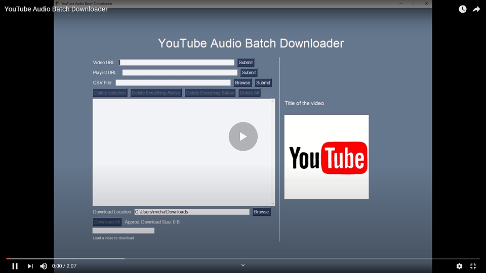

# Youtube Audio Batch Downloader - Python App
 A program that allows you to load unlisted and public YouTube videos and playlists 
 and download them all at once as individual MP4 files.  
 This program also supports reading CSV files that contain valid URLs to a YouTube 
 video/playlist.
 
  ## Demo
   
   [](https://www.youtube.com/watch?v=F4dSwk73PIw)
  ## Installation 

  * Install the required modules:  
    ```pip install -r requirement.txt```  
  * Run ```main.py```

  
  ## Technologies
  * [Python 3.8](https://www.python.org/)
  * [PySimpleGUI 4.32.1](https://pypi.org/project/PySimpleGUI/)
  * [Pytube 10.1.0](https://python-pytube.readthedocs.io/en/latest/)
  * [Pillow 7.2.0](https://pillow.readthedocs.io/en/stable/)  
   
   